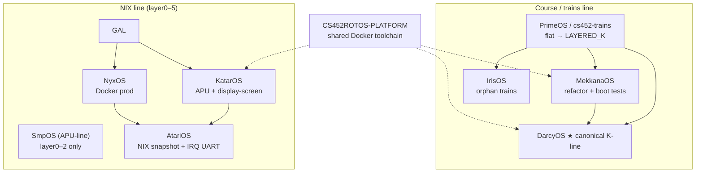

# CS452 ROTOS — Code Evolution Tree

This is the **feature / architecture evolution** of the ROTOS family — not git history. It shows how capabilities accumulated and how repos relate.

## Family tree (repos)



## Capability evolution (what shipped when)

```text
CS452 K1 baseline
├── context switch, syscalls, first tasks
│
K2 messaging
├── Send / Receive / Reply
├── nameserver, gameserver (RPS)
│
K3 time + interrupts
├── clock server, timer PPI
├── GIC distributor + CPU interface
│
K4 I/O (two converging implementations)
├── [K-line] k4/servers: io_notifier, UART1_CONSOLE, UART2_MARKLIN, display, shell
└── [NIX]     layer3-services/uart: same IRQ model, NIX paths
│
TC1 train control
├── marklin_worker, track_server, goto, velocity
│
NIX platform layer (not in K-line yet)
├── layer4 UI + display_client
├── ramfs / diskfs
├── eventbus
├── accel cores 1–3 + APUServer
└── browser display-screen bridge
│
DevOps unification (2026)
├── codejedi-ai/cs452rotos-platform:latest
└── ./dev.sh make | run | test (all active repos)
```

## Layout divergence

| Line | Directory pattern | Console I/O | Multi-core |
|------|-------------------|-------------|------------|
| **SMP-line** | `src/k0`…`k4`, `common`, `tc1` | `k4/servers/uart/` | Planned (`k4/servers/apu/`) |
| **NIX** | `src/layer0-assembly`…`layer5-applications` | `layer3-services/uart/` | `accel` + `apu_server` |

Both lines target the **same IRQ UART behaviour**; only folder names differ.

## Per-repo maturity (snapshot)

| OS | K1–K4 | TC1 | IRQ UART | APU | Docker platform | Notes |
|----|-------|-----|----------|-----|-----------------|-------|
| DarcyOS | ● | ● | ● | ○ planned | ● | Canonical |
| IrisOS | ● | ● | ● | ○ | ● | DarcyOS fork |
| MekkanaOS | ● | ● | ● | ○ | ● | Boot self-tests |
| PrimeOS / TRAINS | ● | ● | ● | ○ | ● | Course + mirror |
| KatarOS | ● | ● | ● | ● | ● | Production NIX |
| NyxOS | ● | ● | ● | ● | ● | Prod screen image |
| AtariOS | ● | partial | ● | ● | ● | NIX archive, UART aligned |
| SmpOS (APU-line) | ◐ L1–L2 | ○ | ○ | ○ | ● | Incomplete |

Legend: ● done · ◐ partial · ○ not yet

## Where to read more

- [CS452_FEATURE_MATRIX.md](CS452_FEATURE_MATRIX.md) — per-repo build + feature table
- [APU_MULTI_CORE.md](APU_MULTI_CORE.md) — multi-core server design and feasibility
