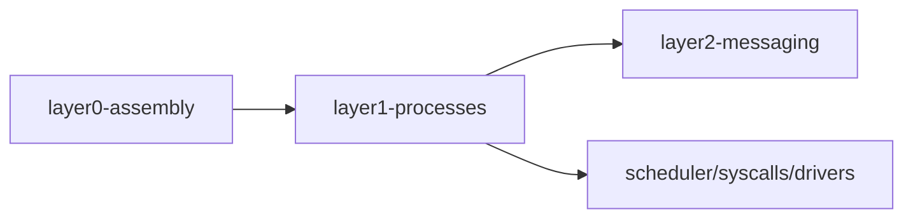
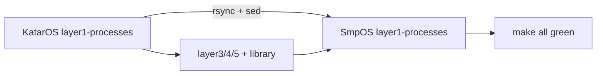

# Cursor Engineering Log — 2026-06-29

## Session: SmpOS layer1-processes rename (was layer1-processes)

### Thought Process & Regression Analysis
- Renamed kernel layer folder to clarify threads vs future user processes.
- Regression Opportunities: Makefile, layer0/layer2 includes, docs paths.
- Execution Strategy: Tests executed via dedicated CI/CD Workflow (build blocked locally: no CS452 toolchain / docker script perms).

### UML Diagram

## Session: SmpOS KatarOS parity sync

### Thought Process & Regression Analysis
- Brought APU-SmpOS to KatarOS NIX feature parity while preserving layer1-processes naming.
- Regression: full kernel link via `bash ./dev.sh make all` → os/0-d273liu.img.

### UML Diagram

